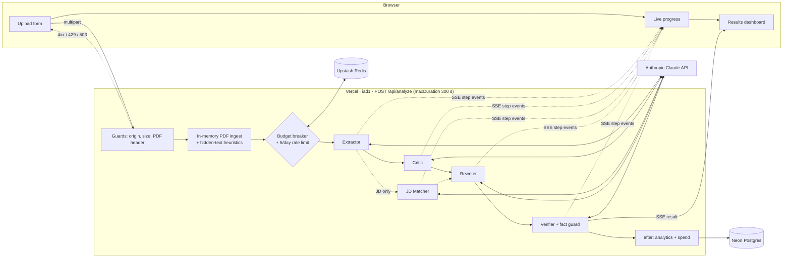

# Resume Optimiser

Web app with agentic workflow for job seekers in **Singapore and Southeast Asia**. Upload a PDF resume, optionally paste a job description, and a pipeline of LLM agents returns:
- a scored critique against a Singapore hiring rubric;
- a job-description match;
- rewritten bullet points that never invent facts.

It runs on Vercel, uses Claude Haiku through the Vercel AI SDK, and keeps only anonymised stats.

| Doc | What's in it |
|---|---|
| [`PLAN.md`](PLAN.md) | Plan, agent contracts, cost model, per-phase status, tuning plan, known limitations |
| [`architecture.md`](architecture.md) | Architecture diagram and component descriptions |
| [`ui-layout.md`](ui-layout.md) · [`mockups/`](mockups/) | UI spec, design decisions and wireframes |

---

## Architecture



- **Pre-stream checks** (plain HTTP errors, no quota used): same-origin check, 4 MB limit, `%PDF-` header, encrypted / scanned / > 4-page rejection.
- **Hidden-text detection**: white, invisible, transparent, tiny and off-page text is detected from pdf.js's drawing operators and **removed before any LLM sees the text**, then reported to the user.
- **Pipeline**: Extractor → Critic ‖ JD Matcher → Rewriter → Verifier. Each is a typed step with a Zod-validated structured output. The overall score is computed in code, and a deterministic fact guard drops any rewrite that adds numbers or names not in the resume. If a non-critical step fails, the user still gets a partial result.
- **Privacy**: the PDF and its text live only in request memory. One anonymised row per run goes to Neon, through a strict allowlist of enums and numbers.

Full detail: [`architecture.md`](architecture.md).

---

## Local development

Requires **Node.js 22.12+** (see `.nvmrc`).

```bash
npm install
cp .env.example .env.local
```

**Try the whole flow without an API key** (a deterministic mock stands in for Claude):

```bash
LLM_MOCK=1 npm run dev          # http://localhost:3000
```

**With real Claude calls**, set `ANTHROPIC_API_KEY` in `.env.local` and run `npm run dev`.

Locally, Neon and Upstash are optional. Without them, the rate limit and budget use in-memory stores and analytics are skipped.

---

## Environment variables

Set them in `.env.local` for development, and in **Vercel → Project → Settings → Environment Variables** for deployments. The production build **fails fast** (listing names, never values) if anything required is missing.

| Variable | Required in prod | Default | Notes |
|---|---|---|---|
| `ANTHROPIC_API_KEY` | ✓ | — | From [platform.claude.com](https://platform.claude.com) → API keys |
| `DATABASE_URL` | ✓ | — | Set by the **Neon** integration (`DATABASE_URL_UNPOOLED` is used for migrations if present). Connected with the prefix `NEON` instead? `NEON_URL` / `NEON_URL_UNPOOLED` are used and take priority |
| `UPSTASH_REDIS_REST_URL` / `_TOKEN` | ✓ | — | Or `KV_REST_API_URL` / `KV_REST_API_TOKEN`, as set by the **Upstash** integration |
| `IP_HASH_SALT` | ✓ | — | Random secret, ≥ 32 characters: `openssl rand -hex 32` |
| `MODEL_EXTRACTOR` … `MODEL_VERIFIER` | | `claude-haiku-4-5` | Per-agent model; see [Swapping models](#swapping-models) |
| `RATE_LIMIT_PER_DAY` | | `5` | Analyses per visitor per 24 h. `0` turns the limit off (e.g. while testing); the monthly budget still applies. Redeploy after changing it |
| `MONTHLY_BUDGET_USD` | | `18` | Spend at which new analyses pause until the 1st (UTC) |
| `NEXT_PUBLIC_PORTFOLIO_URL` | | — | Makes the "Built by toninmotion" footer credit a link |
| `LLM_MOCK` | never | `0` | `1` = mocked LLM for tests / offline dev; **rejected in production** |

---

## Tests and evals

| Command | What it runs |
|---|---|
| `npm run check` | ESLint + `tsc --noEmit` + Prettier check + **Vitest unit tests** (schemas, PDF ingest and heuristics, orchestrator with a mocked LLM, analytics allowlist, rate limiter, budget, route guards) |
| `npm run test:e2e` | **Playwright** (desktop + mobile) against a production build with `LLM_MOCK=1`: upload → progress → dashboard, hidden-text warning, rejections, 429 notice, cancel, keyboard. Set `CHROMIUM_PATH` to use a local Chromium instead of Playwright's download. |
| `npm run eval` | **Eval suite on the real API** (~US$0.50 a run; needs `ANTHROPIC_API_KEY`). Runs 12 synthetic fixtures (`evals/fixtures/`), prints a pass/fail table and the total cost, and writes outputs to `evals/results/latest.json`. `-- --only=jd-match,senior-strong` runs a subset; `EVAL_MOCK=1` is a free plumbing check. |
| `npm run fixtures` | Regenerates the synthetic fixture PDFs (one pair is printed by Chromium for real-world font encoding) |

Evals are kept separate from unit tests because they cost money and aren't deterministic. The tuning process built on them (train/test split, gold labels, US$15 cap) is in [`PLAN.md` §14](PLAN.md#14-quality-tuning-plan-decided-2026-09-26).

---

## Swapping models

Each agent's model is an env var: `MODEL_EXTRACTOR`, `MODEL_CRITIC`, `MODEL_MATCHER`, `MODEL_REWRITER`, `MODEL_VERIFIER`.

- **Allowed values**: the keys of `src/llm/pricing.ts`, currently `claude-haiku-4-5` (default) and `claude-sonnet-5`. The allowlist exists so every run's cost can be computed.
- **Sonnet 5** runs with thinking disabled (`src/llm/models.ts`) to keep cost and latency predictable.
- **To add a model**: add its verified prices to `src/llm/pricing.ts` (and any per-model options to `MODEL_OPTIONS`), then re-run `npm run eval` before switching production to it.
- **Model IDs are pinned.** Re-run the evals before any upgrade.

---

## Costs

| | Estimate |
|---|---|
| One analysis, all Haiku 4.5 | **~US$0.04–0.05** (~19k input + ~5.5k output tokens) |
| One analysis with Critic + Rewriter on Sonnet 5 | ~US$0.077 |
| Rejected upload (wrong type, too big, scanned, rate-limited) | US$0 |
| US$20/month | ~400 analyses on all-Haiku |

- **Real numbers are logged**: every run writes one JSON log line (`"event":"analysis"`) with tokens, cost and latency, and the same numbers go to the `analyses` table.
- **Monthly breaker**: once `MONTHLY_BUDGET_USD` (US$18) of real spend is reached, new analyses get a friendly "back on the 1st" message.
- **Prompt caching**: breakpoints are in place, but Haiku 4.5 only caches prompts of 4,096+ tokens, so expect little caching at this size. Cache hits show up in the logged token counts.
- **Vercel Hobby, Neon Free and Upstash Free** are enough at this volume. Check their current limits in each dashboard.

---

## Deploying to Vercel (+ Neon + Upstash)

Everything is configured by env vars and integrations; no code changes are needed. Budget about 20 minutes.

### 1. Anthropic

1. In [platform.claude.com](https://platform.claude.com), add credit, then create an API key for production (separate from your dev key).
2. Under **Settings → Limits**, set a monthly spend limit (e.g. US$20).

### 2. Vercel project

1. Sign in to [vercel.com](https://vercel.com) with GitHub (the **Hobby** plan is fine for a free, non-commercial tool).
2. **Add New → Project**, import `tmiharja/resume-scorer-optimiser`. Next.js is detected automatically. Don't deploy yet: add the integrations and variables first. If it deploys anyway, the first build will fail with a list of missing variables, which is expected.
3. **Settings → Functions**: make sure **Fluid Compute** is on (the default for new projects). The function region comes from `vercel.json` (`iad1`, Washington D.C.), close to the Anthropic API.

### 3. Neon Postgres (analytics)

1. In the project: **Storage → Create Database → Neon** (Vercel Marketplace), Free plan.
2. Choose region **AWS us-east-1 (N. Virginia)** to sit next to `iad1`.
3. Connect it to the project for **Production, Preview and Development**, keeping the environment variable prefix `DATABASE`. This sets `DATABASE_URL` and `DATABASE_URL_UNPOOLED` (preview deployments get their own database branch).
   - If Vercel says *"This project already has an existing environment variable with name DATABASE_URL"*, either delete that old variable first, or use the prefix **`NEON`** instead. The app reads `NEON_URL` / `NEON_URL_UNPOOLED` (or `NEON_DATABASE_URL`) too, and prefers them over `DATABASE_URL`.
4. Nothing else to do: **migrations run automatically on every deploy** (`scripts/vercel-build.ts` runs `drizzle-kit migrate`, which is idempotent).

### 4. Upstash Redis (rate limit + budget)

1. **Storage → Create Database → Upstash for Redis** (Marketplace), Free plan, region **us-east-1**.
2. Connect it to the project for all environments. This sets `KV_REST_API_URL` and `KV_REST_API_TOKEN`, which the app accepts.

### 5. Remaining environment variables

In **Settings → Environment Variables** (Production, and Preview if you want previews to work):

| Name | Value |
|---|---|
| `ANTHROPIC_API_KEY` | your production key |
| `IP_HASH_SALT` | output of `openssl rand -hex 32` (keep it secret; changing it resets everyone's daily count) |
| `NEXT_PUBLIC_PORTFOLIO_URL` | your portfolio URL (optional) |

Leave `MODEL_*`, `RATE_LIMIT_PER_DAY` and `MONTHLY_BUDGET_USD` unset to use the defaults. **Never set `LLM_MOCK` in production**; the app refuses to start if you do.

### 6. Deploy

**Deployments → Redeploy**, or push to `main`. The build (`npm run vercel-build`):

1. **validates the environment** and fails with a list of missing variable names if anything's wrong;
2. **applies database migrations** when a database is connected;
3. runs `next build`.

### 7. Smoke test (≈ US$0.05)

1. Open the production URL and upload a real PDF resume with a short job description.
2. Watch the progress steps, then check the results page.
3. In **Vercel → Logs**, find the `"event":"analysis"` line and check `costUsd`.
4. In **Neon → Tables → analyses**, you should see one row with no personal data.
5. Optional: upload `evals/fixtures/hidden-injection.pdf` to see the hidden-text warning.

### Troubleshooting

| Symptom | Likely cause |
|---|---|
| Build fails with "Invalid environment configuration" | A required variable is missing for that environment: the message names it |
| "The analyser isn't available right now" (503) | Runtime config or Redis problem: check Vercel logs for `"event":"error"` with `where: analyze.config` or `analyze.guards` |
| "We've reached this month's capacity" | The monthly budget breaker tripped: raise `MONTHLY_BUDGET_USD` or wait for the 1st |
| Analyses stop with an error mid-way | Check the Anthropic Console for credit and spend-limit status |
| No rows in Neon | Check logs for `analyze.analytics` errors and that `DATABASE_URL` (or `NEON_URL`) is set for Production |
| Connecting Neon fails: "existing environment variable with name DATABASE_URL" | Delete the old `DATABASE_URL`, or connect with the prefix `NEON` (see step 3 above) |

---

## Project structure

```
src/
  app/            page, privacy page, POST /api/analyze (SSE)
  agents/         extractor, critic, matcher, rewriter, verifier, orchestrator, fact guard, scoring
  prompts/        system prompts + versioned SG rubric (rubric-sg.ts)
  schemas/        Zod schemas: agent outputs, result, SSE events, ingest, enums
  ingest/         in-memory PDF parsing, validation, hidden-text heuristics, SG PII checks
  llm/            model resolution, pricing, mock model
  server/         guards (rate limit, budget), analytics allowlist, logging, request helpers
  db/             Drizzle schema + client (Neon)
  components/     site shell, hero, analyzer UI (upload, progress, results)
  lib/            SSE client, useAnalysis state machine, client validation
evals/            fixtures, cases, runner
tests/            unit (Vitest), e2e (Playwright), fixture builder
drizzle/          SQL migrations
scripts/          vercel-build, check-env
```

