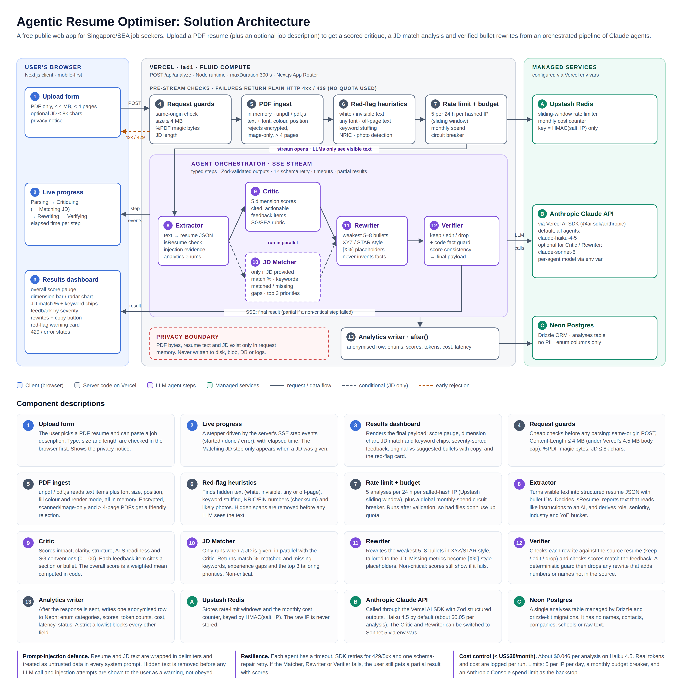
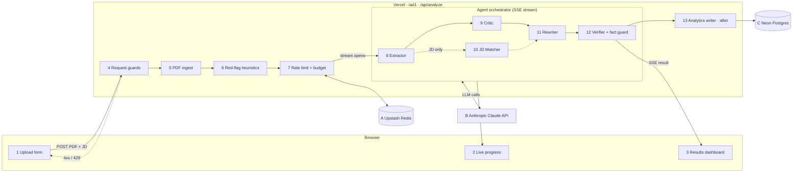

# Architecture: Agentic Resume Optimiser (SG/SEA)

This is a free public web app. A user uploads a PDF resume and can optionally paste a job description (JD). An orchestrated pipeline of Claude agents returns a scored critique, a JD match analysis and verified bullet rewrites.

This document describes the target architecture. See [`PLAN.md`](PLAN.md) for agent schemas, cost estimates, env vars, testing and open questions.

---

## 1. Deployment view

| Zone | What runs there |
|---|---|
| **User's browser** | Next.js client UI (mobile-first): upload form, live progress stepper, results dashboard |
| **Vercel** (`iad1`, Fluid Compute) | A single Next.js App Router app. `POST /api/analyze` runs on the Node runtime with `maxDuration = 300` s, the Hobby maximum |
| **Upstash Redis** (`us-east-1`) | Sliding-window rate limiter and the monthly cost counter |
| **Anthropic Claude API** | Every LLM step, called through the Vercel AI SDK (`@ai-sdk/anthropic`) |
| **Neon Postgres** (`aws-us-east-1`) | Anonymised `analyses` table, via Drizzle ORM + drizzle-kit migrations |

Vercel, Neon and Upstash sit in the same US-East area, close to the Anthropic API. Each full run is dominated by about 45–55 s of LLM time, so the ~200 ms round-trip from Singapore to `iad1` doesn't matter.

---

## 2. Request flow

The request goes through two phases:

1. **Pre-stream checks (④–⑦)** are fast, deterministic and use plain HTTP. Any failure returns a normal `4xx` or `429` JSON response, and the user's daily quota is not used.
2. **Streaming phase (⑧–⑫).** Once the rate limit passes, the response becomes a Server-Sent Events stream. It emits `step` events (`started` / `done` / `error` / `skipped`) for each agent, then one terminal `result` or `error` event.

---

## 3. Components

### Browser

| # | Component | Responsibility |
|---|---|---|
| ① | **Upload form** | Takes the PDF resume and an optional JD. Checks type, size (≤ 4 MB) and JD length (≤ 8k chars) in the browser first. Shows the privacy notice. |
| ② | **Live progress** | Stepper driven by SSE `step` events: Parsing → Critiquing (→ Matching JD) → Rewriting → Verifying, with elapsed time. The Matching JD step only appears when a JD was given. |
| ③ | **Results dashboard** | Renders the final payload: overall score gauge, dimension bar/radar chart, JD match % with matched/missing keyword chips, feedback grouped by dimension and sorted by severity, original-vs-suggested bullets with a copy button, the red-flag warning card, and 429/error states. |

### Server: pre-stream checks

| # | Component | Responsibility |
|---|---|---|
| ④ | **Request guards** | Cheap checks before any parsing: same-origin `Origin` header, `Content-Length` ≤ 4 MB (under Vercel's 4.5 MB body cap), `%PDF-` magic bytes (the MIME type alone isn't trusted), JD ≤ 8k chars. |
| ⑤ | **PDF ingest** | `unpdf` / pdf.js reads text items plus font size, position, fill colour and text render mode, all in memory. Encrypted, scanned/image-only and > 4-page PDFs get a friendly rejection. |
| ⑥ | **Red-flag heuristics** | Detects white or invisible text, tiny fonts, off-page text, keyword stuffing, NRIC/FIN numbers (checksum validated) and likely photos. Hidden spans are **removed** before any LLM sees the text, so scores ignore injected content. The findings go to the user as warnings. |
| ⑦ | **Rate limit + budget** | 5 analyses per 24 h per IP, where the key is a salted HMAC of the IP (Upstash sliding window), plus a global monthly-spend circuit breaker. Runs after validation, so a bad file doesn't use up quota. |

### Server: agent orchestrator

This is an orchestrated pipeline, not an autonomous agent. Each step is a typed function in `src/agents/`. It has its own system prompt in `src/prompts/` and Zod-validated structured output, and runs through a shared `runAgent()` wrapper that provides:
- a per-agent timeout;
- SDK retries for 429/5xx errors;
- one schema-repair retry;
- token and cost capture.

| # | Agent | Critical? | Responsibility |
|---|---|---|---|
| ⑧ | **Extractor** | yes | Turns visible text into structured resume JSON with stable bullet IDs. It also decides `isResume`, reports text that reads like instructions to an AI (`injectionSuspected` + evidence), and derives the enum-only analytics fields: role family, seniority, industry, years-of-experience bucket. |
| ⑨ | **Critic** | yes | Scores five dimensions (0–100): impact/quantification, clarity & concision, structure & formatting, ATS readiness and SG-market conventions. Every feedback item cites a section or bullet ID. The **overall score is a weighted mean computed in code**, not by the LLM. |
| ⑩ | **JD Matcher** | no | Only runs when a JD is given, **in parallel with the Critic**. Returns match %, matched and missing keywords, experience gaps and the top 3 tailoring priorities. |
| ⑪ | **Rewriter** | no | Rewrites the weakest 5–8 bullets in XYZ/STAR style, tailored to the JD if there is one. Missing metrics become placeholders such as `[X%]`. It never invents numbers, employers or achievements. |
| ⑫ | **Verifier** | no | Returns keep/edit/drop for each rewrite against the source resume and checks that scores are consistent with the feedback (adjustments clamped to ±10). A **deterministic fact guard** then runs whether the Verifier succeeded or not: it drops any rewrite that adds numbers or proper nouns not in the source. |

If a **non-critical** step fails, the user still gets a partial result with scores (`status: "partial"`). If a critical step fails, the stream ends with an `error` event.

### Server: persistence

| # | Component | Responsibility |
|---|---|---|
| ⑬ | **Analytics writer** | Runs in `after()` once the response has been sent. It writes one anonymised row: enum categories, page count, scores, JD provided/match score, injection flag, rubric version, model IDs, tokens, cost, latency and status. A strict Zod allowlist blocks every other field. |

### Managed services

| | Service | Usage |
|---|---|---|
| Ⓐ | **Upstash Redis** | Rate-limit windows and the monthly cost counter, keyed by `HMAC(salt, IP)`. The raw IP is never stored. Uses the Vercel Marketplace integration. |
| Ⓑ | **Anthropic Claude API** | Called through the Vercel AI SDK with Zod structured outputs. Every agent defaults to `claude-haiku-4-5` (about $0.046 per analysis). The Critic and Rewriter can be switched to `claude-sonnet-5` through env vars (`MODEL_CRITIC`, `MODEL_REWRITER`). System prompts carry prompt-cache breakpoints. |
| Ⓒ | **Neon Postgres** | A single `analyses` table managed by Drizzle + drizzle-kit migrations. It holds no names, contact details, companies, schools or raw text. Uses the Vercel Marketplace integration. |

---

## 4. Cross-cutting concerns

### Privacy (PDPA-friendly)
- PDF bytes, resume text and JD text exist **only in request memory**. They're never written to disk, blob storage, the DB or logs.
- Errors are logged as `{ errorClass, code, step }` only, because SDK error objects can carry model output that contains resume content. AI SDK telemetry is off.
- Analytics columns use Postgres enums, so free text (and any PII in it) can't leak into the table. A unit test asserts that the insert payload keys are a subset of the allowlist.

### Prompt-injection defence
- Resume and JD text are wrapped in delimiters (`<resume_text>`, `<job_description>`) and treated as **untrusted data** in every system prompt. Instructions inside them are never followed.
- There are two detection layers: deterministic ingest heuristics (⑥) and the Extractor's `injectionSuspected` check (⑧).
- If either layer fires, the user sees a warning card and the analysis continues. Hidden text has already been removed, so it can't affect scores.

### Resilience
- Each agent has a timeout. Retries: SDK retries for 429/5xx plus one schema-repair retry.
- A global deadline of 270 s sits under the 300 s `maxDuration`.
- Non-critical failures give a partial result rather than an error.

### Cost control (< US$20/month)
- Every agent defaults to the cheapest model, Haiku 4.5, with tight output schemas.
- Real input/output/cache tokens and `cost_usd` are logged for each run.
- Guardrails: 5 analyses per IP per day, a monthly budget circuit breaker (`MONTHLY_BUDGET_USD`), and a spend limit in the Anthropic Console as the hard backstop.

### Testing
- **Unit (Vitest)**: schemas, PDF ingest and heuristics, orchestrator with a mocked LLM, analytics allowlist, rate limiter.
- **E2E (Playwright)**: upload → progress → dashboard, the rate-limit message, and non-PDF/oversize rejection, with `LLM_MOCK=1` (not allowed in production).
- **Evals (`npm run eval`)**: 10 synthetic fixtures run against the real API, with expected score ranges and must-flag / must-not-hallucinate assertions. Output is a pass/fail table plus total cost.

---

## 5. Out of scope for MVP (the design leaves room for these)

- Login/accounts
- DOCX upload
- OCR
- Exporting the improved resume
- Report download
- Multiple regions/rubrics
- Payments
- LinkedIn import

The versioned rubric constant, enum-based analytics and per-agent model config are the extension points for these.
